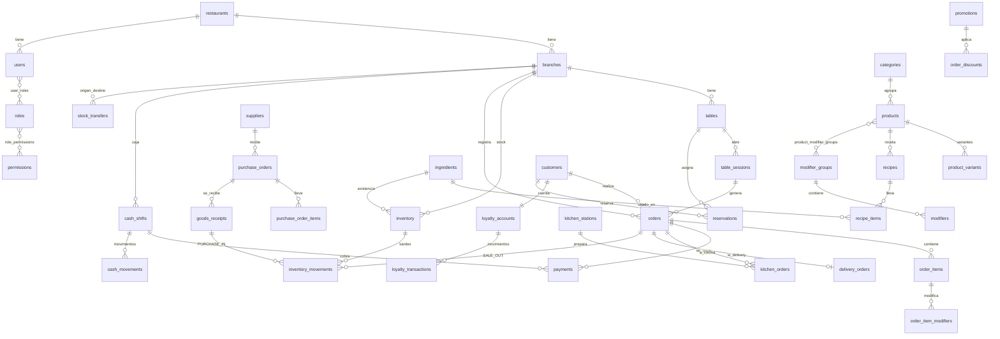

# 🍔 RETROBURGER ERP — Fase 0: Arquitectura y Roadmap

> Estado: **PROPUESTA PARA VALIDACIÓN**. No hay código de implementación todavía.
> Prioridades de decisión (en orden): correcto funcionamiento → seguridad → integridad de datos → UX → rendimiento → escalabilidad → estética.

---

## 0. Decisiones que requieren tu validación

Puntos donde el prompt no define algo y propongo una opción (regla 67).

| # | Tema | Opción A | Opción B | Recomendación y motivo |
|---|------|----------|----------|------------------------|
| D1 | Aislamiento multi-tenant | Una BD por tenant | Una BD compartida + `tenant_id` + **Row-Level Security (RLS)** de PostgreSQL | **B**. Escala a cientos de restaurantes con costo bajo; RLS da aislamiento forzado por la BD (no depende de que cada query recuerde filtrar). Se puede migrar a "BD dedicada" para clientes enterprise porque el código siempre pasa por el contexto de tenant. |
| D2 | Estilo de backend | Microservicios | **Monolito modular** | **Monolito modular**. Un equipo pequeño, transacciones ACID críticas (venta + pago + inventario). Los módulos tienen fronteras estrictas para extraer servicios luego (KDS/notificaciones primero). |
| D3 | Lenguaje | TypeScript full-stack | Java/Kotlin o Go en backend | **TypeScript en todo**. Tipos compartidos front/back (DTOs, estados), un solo lenguaje, ecosistema POS/PWA. |
| D4 | Framework backend | Express | **NestJS** | **NestJS**: módulos, DI, guards, interceptors, pipes → mapea 1:1 con tu requisito Controllers/Services/Repositories/DTOs/Validators/Middleware. |
| D5 | ORM | Prisma | Drizzle / SQL puro | **Drizzle + SQL de migraciones versionadas**. Control fino de RLS, índices parciales, `CHECK`, vistas y triggers de inmutabilidad (Prisma los soporta mal). |
| D6 | Frontend | Next.js (SSR) | **React + Vite SPA/PWA** (app interna) + **Next.js** solo para sitio público | **Dos apps**: `web-admin` (Vite, PWA offline para POS/KDS) y `web-public` (Next.js, SEO para menú/pedidos/reservas). SSR no aporta al POS y complica el offline. |
| D7 | Tiempo real | Polling | **WebSocket (Socket.IO) + Redis pub/sub** | **WebSocket** para KDS, mesas, notificaciones. Fallback automático a polling. |
| D8 | Offline | Sólo caché de lectura | **Cola de operaciones (outbox) con IDs generados en cliente** | **B**. Requisito: "no perder ventas". |
| D9 | Facturación fiscal | Integrada | **Interfaz `FiscalProvider` + adaptador** | País/PAC no definido en el prompt (moneda en ejemplos `$`, IVA → posiblemente México/CFDI). **Necesito que confirmes el país** antes de la fase de facturación. Hasta entonces: interfaz + adaptador "none". |
| D10 | Pagos con tarjeta | Integrada | Registro manual + interfaz `PaymentGateway` | Fase 1: registro manual de método/referencia. Terminal/QR integrados en fase posterior vía adaptadores. |
| D11 | Dinero | `float` | **`NUMERIC(14,4)` en BD / enteros de centavos en código (Money value object)** | Nunca `float`. Redondeo definido por configuración de moneda. |
| D12 | Hosting objetivo | — | Docker + PostgreSQL gestionado + Redis + S3-compatible | Contenedores portables (cualquier nube). |

---

## 1. Arquitectura general del sistema

```
                        ┌────────────────────────────────────────────┐
  Clientes finales ───► │  web-public (Next.js)  menú·carrito·QR     │
                        └───────────────┬────────────────────────────┘
  Staff (POS/KDS/ERP)                   │ HTTPS
  ┌──────────────────────────────┐      │
  │ web-admin (React PWA)        │──────┤
  │  · UI retro (design system)  │      ▼
  │  · IndexedDB + Outbox (offl.)│  ┌──────────────┐   ┌─────────────────────┐
  │  · Service Worker            │  │  API Gateway │   │ WebSocket Gateway   │
  └──────────────────────────────┘  │  (NestJS)    │◄─►│ (Socket.IO + Redis) │
                                    └──────┬───────┘   └──────────┬──────────┘
                                           │ módulos               │
        ┌───────────────┬──────────────┬───┴─────────┬─────────────┴──────────┐
        │ Identity      │ Catalog      │ Sales       │ Inventory/Purchasing   │
        │ (auth, RBAC)  │ (menú,recetas)│ (POS,pago) │ (stock, compras)       │
        │ Kitchen (KDS) │ CRM/Loyalty  │ Cash        │ Reports/Analytics      │
        │ Reservations  │ Delivery     │ Promotions  │ Notifications·Audit    │
        └───────┬───────┴──────┬───────┴──────┬──────┴──────────┬─────────────┘
                │              │              │                 │
          ┌─────▼─────┐   ┌────▼────┐   ┌─────▼─────┐   ┌───────▼───────┐
          │PostgreSQL │   │  Redis  │   │ Object    │   │ Job Queue     │
          │ + RLS     │   │ cache,  │   │ Storage   │   │ (BullMQ):     │
          │           │   │ pubsub, │   │ (imágenes,│   │ reportes,     │
          │           │   │ rate-lim│   │ PDFs)     │   │ emails, sync  │
          └───────────┘   └─────────┘   └───────────┘   └───────────────┘
```

**Principios**
1. **Monolito modular** con fronteras duras: un módulo sólo habla con otro mediante su *servicio público* o *eventos de dominio*, nunca tocando sus tablas.
2. **Eventos de dominio** (`OrderPaid`, `StockLow`, `KitchenTicketReady`…) desacoplan inventario, notificaciones, lealtad, auditoría y KDS de la venta. Patrón **Transactional Outbox**: el evento se escribe en la misma transacción que el cambio y un worker lo publica (nada se pierde).
3. **La BD es la fuente de verdad de integridad**: FKs, `CHECK`, índices únicos, RLS, triggers de inmutabilidad en kardex y auditoría.
4. **Idempotencia en toda escritura crítica** (header `Idempotency-Key` / `client_uuid`), necesario para offline y reintentos.
5. **Sin lógica de negocio en UI**; la UI sólo orquesta y muestra. El backend recalcula todos los totales (nunca confía en precios del cliente).

---

## 2. Stack tecnológico recomendado

| Capa | Tecnología |
|------|-----------|
| Lenguaje | TypeScript 5 (strict) |
| Monorepo | pnpm workspaces + Turborepo |
| Backend | Node 22, NestJS, Fastify adapter, `zod` (validación + DTOs compartidos), Drizzle ORM |
| BD | PostgreSQL 16 (RLS, `pgcrypto`, `pg_trgm`, particionado de tablas grandes) |
| Cache / pubsub / colas | Redis 7, BullMQ |
| Tiempo real | Socket.IO (rooms por `tenant:branch:station`) |
| Auth | Argon2id, JWT access (15 min) + refresh rotativo en cookie `HttpOnly`, TOTP 2FA opcional, PIN rápido de POS |
| Frontend admin | React 18, Vite, TanStack Router + TanStack Query, Zustand (estado UI), React Hook Form + zod, Workbox (PWA), Dexie (IndexedDB) |
| Frontend público | Next.js 15 (App Router) |
| Estilos | Tailwind + **design tokens** (CSS variables) + Radix UI primitives (accesibilidad) — componentes `Retro*` encima |
| Gráficos | Recharts (envuelto en `RetroChart`) |
| Docs API | OpenAPI 3.1 generado desde zod (Swagger UI en `/docs`) |
| Tests | Vitest (unit), Supertest + Testcontainers-PostgreSQL (integración/API/BD), Playwright (E2E), k6 (carga) |
| Observabilidad | Pino (logs JSON), OpenTelemetry, Sentry, health/readiness endpoints |
| CI/CD | GitHub Actions: lint, typecheck, tests, migraciones en BD efímera, build Docker, escaneo de secretos/dependencias |
| Infra | Docker Compose (dev), contenedores en producción, secretos por variables de entorno / gestor de secretos |

**Tipografías (licencia libre, Google Fonts, autoalojadas):** títulos `Press Start 2P` (arcade, sólo títulos cortos/numéricos grandes) y `Bungee` o `Chango` (cartel diner); datos y tablas `Inter` / `IBM Plex Sans` + `JetBrains Mono` para cifras. Regla: **ninguna tabla ni formulario usa fuente pixel**.

---

## 3. Estructura de carpetas (monorepo)

```
retroburger/
├─ apps/
│  ├─ api/                    # NestJS
│  │  └─ src/
│  │     ├─ main.ts · app.module.ts
│  │     ├─ common/           # middleware, guards, interceptors, filtros de error, pipes, logger
│  │     ├─ config/           # carga/validación de env (zod) — sin secretos en código
│  │     ├─ database/         # conexión, contexto de tenant (RLS), migraciones, seeds
│  │     ├─ modules/
│  │     │  ├─ identity/      # auth, users, roles, permissions, sessions
│  │     │  ├─ tenancy/       # restaurants (tenants), branches, settings
│  │     │  ├─ catalog/       # categories, products, variants, modifiers, combos, recipes
│  │     │  ├─ inventory/     # ingredients, stock, movements, transfers, counts, lots
│  │     │  ├─ purchasing/    # suppliers, quotes, purchase orders, receptions, invoices
│  │     │  ├─ sales/         # orders, order items, payments, refunds, discounts
│  │     │  ├─ floor/         # tables, table sessions, reservations
│  │     │  ├─ kitchen/       # stations, kitchen tickets, KDS gateway
│  │     │  ├─ cash/          # registers, shifts, movements, cortes
│  │     │  ├─ crm/           # customers, segments
│  │     │  ├─ loyalty/       # accounts, transactions, rules, rewards
│  │     │  ├─ promotions/    # motor de reglas
│  │     │  ├─ delivery/      # delivery orders, drivers
│  │     │  ├─ staff/         # employees, schedules
│  │     │  ├─ reports/       # consultas de reporte, analytics, exportación
│  │     │  ├─ notifications/ # in-app, email, push, reglas
│  │     │  ├─ printing/      # plantillas + cola de impresión
│  │     │  ├─ billing/       # FiscalProvider, facturas
│  │     │  ├─ sync/          # endpoint de sincronización offline
│  │     │  └─ audit/         # audit_logs
│  │     └─ integrations/     # adaptadores externos (pagos, fiscal, SMS, mail)
│  │        # Cada módulo:  controller/ service/ repository/ dto/ validators/ domain/ events/ tests/
│  ├─ web-admin/              # React PWA (POS, KDS, ERP)
│  └─ web-public/             # Next.js sitio de cliente + QR de mesa
├─ packages/
│  ├─ shared/                 # zod schemas/DTOs, enums de estado, tipos, Money, permisos (fuente única)
│  ├─ ui/                     # design system Retro* + tokens + Storybook
│  ├─ api-client/             # cliente tipado generado desde OpenAPI
│  └─ offline-core/           # outbox, sync engine, reglas de conflicto (usado por web-admin)
├─ db/
│  ├─ migrations/             # SQL versionado (forward-only)
│  └─ seeds/                  # RETROBURGER demo
├─ docs/                      # ARCHITECTURE.md, ADRs, API, runbooks
├─ e2e/                       # Playwright
├─ infra/                     # docker, compose, CI
└─ .env.example               # sólo nombres de variables, nunca valores reales
```

---

## 4. Arquitectura Frontend

**Capas** (sin mezclar lógica en componentes):
```
Rutas/Páginas (composición) ─► Features (POS, KDS, Inventario…) ─► hooks de dominio (useCart, useOrder)
        ─► api-client (TanStack Query) / offline-core ─► API
Componentes puros: packages/ui (Retro*)  — sin conocimiento del dominio
```
- **Design system** `packages/ui`: tokens (color, tipografía, espaciado, sombras "pixel", glow neón) como CSS variables → temas futuros por tenant (white-label SaaS).
  - Paleta: `--ketchup #D62828`, `--mustard #F6B800`, `--orange #F77F00`, `--cream #FFF4DC`, `--ink #111`, `--white #FFF`, `--neon-green #39FF14` (secundario), `--electric-blue #1E6BFF` (acento). Fondo crema, tarjetas blancas, bordes negros gruesos con sombra dura offset (estilo cartel/arcade), neón sólo en acentos/estados.
  - Estados semáforo (inventario/mesas) siempre con **icono + texto**, no sólo color (accesibilidad).
- **Componentes (los 19 pedidos):** RetroButton, Card, Modal, Input, Select, Table, Badge, Toast, Dialog, Sidebar, Navbar, Tabs, StatCard, Chart, POSButton, ProductCard, TableCard, KitchenTicket, OrderCard. Cada uno con Storybook, variantes y test visual. **Regla (64):** antes de una pantalla nueva se revisa Storybook; PR que duplica un componente se rechaza.
- **Modo POS táctil**: objetivos ≥ 48 px, sin hover como requisito, gestos mínimos, tamaño de fuente escalable, layout 3 columnas (categorías / productos / ticket) que colapsa en tablet y celular (ticket como panel inferior).
- **Estado**: servidor → TanStack Query; efímero de UI → Zustand; ticket en edición → store persistido en IndexedDB (sobrevive a recargas).
- **Navegación**: layout por rol; el menú se genera desde permisos (`can('inventory.read')`), no desde `if (role === …)`.
- **Sidebar arcade** colapsable (icon-rail), estado recordado por usuario.
- **Animaciones**: CSS only (transform/opacity), respeta `prefers-reduced-motion`; modo "rendimiento" las desactiva.
- **Sonidos**: `SoundService` con `Howler`, eventos mapeados (`order.new`, `order.ready`, `sale.done`, `error`), configurable por usuario/sucursal, apagado por defecto en KDS hasta interacción (política de autoplay).
- **Modo Arcade (INSERT COIN)**: temporizador de inactividad (configurable, **nunca** activo con ticket abierto o turno de caja en operación sin PIN; se cierra con cualquier toque).
- **i18n** desde el día 1 (es-MX base, en-US) y formato de moneda por configuración.
- **Errores**: `ErrorBoundary` + mapeo de códigos de error de API a mensajes humanos ("⚠️ No pudimos registrar el pedido. La información permanece guardada y puedes intentarlo nuevamente."). Jamás se muestra un stack ni "500".

---

## 5. Arquitectura Backend

**Flujo de una request**
```
Request → Helmet/CORS → RateLimit → RequestId+Logger → AuthGuard (JWT) → TenantContext
        → PermissionGuard (RBAC) → ZodValidationPipe → Controller → Service (reglas, transacción)
        → Repository (Drizzle, SET LOCAL app.tenant_id) → DB (RLS)
        → Eventos de dominio (outbox) → AuditInterceptor → Response / ExceptionFilter (error humano)
```

**Responsabilidades**
- **Controller**: HTTP únicamente (parseo, códigos). Sin lógica.
- **DTO/Validator** (zod, compartidos en `packages/shared`): validación estricta, `strip` de campos desconocidos.
- **Service**: reglas de negocio y transacciones. Aquí vive "pagar orden", "descontar receta".
- **Repository**: único lugar con SQL. Siempre parametrizado (anti-inyección). Todas las lecturas por tenant vía RLS.
- **Domain**: entidades/value objects (`Money`, `OrderStatus` con máquina de estados, `StockQuantity`).
- **Transacciones**: operaciones multi-tabla (pago + inventario + lealtad + kardex) en **una transacción** `SERIALIZABLE`/`REPEATABLE READ` con bloqueo `SELECT … FOR UPDATE` de filas de stock en orden determinista (evita deadlocks y sobreventa).
- **Errores**: jerarquía `DomainError` (código estable `ORDER_ALREADY_PAID`, mensaje es-MX amigable, HTTP status, `retryable`) + filtro global; los 500 se registran con `request_id` y al usuario se le muestra mensaje seguro.
- **Logging (Pino JSON)**: request/response (sin cuerpos sensibles), auth, pagos, inventario, cambios de configuración; campos `tenant_id, branch_id, user_id, request_id`. Redacción de PII/tokens.
- **Jobs (BullMQ)**: reportes pesados, cierre de lealtad, alertas de caducidad, envío de correos, reintento de impresión, publicación del outbox.
- **Almacenamiento**: imágenes (URLs firmadas), PDFs; validación de MIME y tamaño, re-codificación de imagen.
- **Config**: `env` validado al arrancar con zod; la app **no inicia** si faltan secretos.

---

## 6. Modelo de base de datos

### 6.1 Convenciones
- PK `uuid` (v7, ordenable por tiempo). Todas las tablas de negocio llevan `tenant_id uuid NOT NULL` (y `branch_id` donde aplica).
- `created_at, updated_at, created_by, updated_by`; `deleted_at` (soft delete) en catálogos/personas; **sin** soft delete en movimientos financieros/inventario (son **append-only**; se corrigen con contra-asientos).
- Dinero `numeric(14,4)`, cantidades `numeric(14,4)` con unidad base por ingrediente; `CHECK (qty >= 0)` donde proceda.
- Índices compuestos que empiezan por `tenant_id`; índices parciales `WHERE deleted_at IS NULL`; `UNIQUE (tenant_id, sku)`.
- **RLS** en todas: `USING (tenant_id = current_setting('app.tenant_id')::uuid)`. El rol de aplicación **no** es dueño de las tablas ni tiene `BYPASSRLS`.
- Triggers: `inventory_movements`, `payments`, `cash_movements`, `audit_logs` → `UPDATE/DELETE` prohibido.
- Numeración legible (`orders.number`, `purchase_orders.number`) por sucursal+día mediante tabla `counters` con bloqueo.

### 6.2 Entidades por dominio

**Tenancy / Identidad**
- `restaurants` (tenant): name, legal_name, tax_id, plan, status, currency, locale, timezone.
- `branches`: restaurant_id, name, code, address, geo, phone, status, opening_hours (jsonb), tax_config.
- `users`: tenant_id, email (único por tenant), password_hash (argon2id), pin_hash, status, mfa_secret (cifrado), last_login_at, failed_attempts, locked_until.
- `roles` (por tenant, `is_system`), `permissions` (catálogo global `módulo.acción`), `role_permissions`, `user_roles` (user, role, **branch_id nullable** = alcance: null = todas las sucursales).
- `refresh_tokens` (hash, family_id, expires_at, revoked_at, ip, user_agent) — rotación con detección de reuso.
- `employees`: user_id?, branch_id, name, phone, email, position, salary (cifrado/columna restringida), hired_at, status.
- `settings` (tenant/branch, key, jsonb value, versionado).

**Catálogo**
- `categories`, `products` (sku, barcode, description, image_url, price, cost (calculado), tax_rate_id, is_available, is_inventoriable, prep_time_sec, station_id, kind: `SIMPLE|COMBO`), `product_variants` (tamaño; price delta; sku), `branch_products` (override de precio/disponibilidad por sucursal).
- `modifier_groups` (min/max selección, tipo EXTRA|REMOVE|CHOICE), `modifiers` (price_delta, **recipe_delta**: ingrediente y cantidad ± que afecta inventario), `product_modifier_groups`.
- `combo_items` (combo_id, slot, `product_id` por defecto, `allowed_substitutes`, price_delta).
- `recipes` (product_id/variant_id, version, active), `recipe_items` (ingredient_id, qty, unit, waste_pct). Versionadas para costo histórico.
- `taxes` (rate, included_in_price).

**Inventario**
- `ingredients` (sku, unit_base, min/max defaults, perishable, avg_cost).
- `inventory` (**stock actual por sucursal**): branch_id, ingredient_id, qty, min, max, status (derivado), `UNIQUE(branch_id, ingredient_id)`.
- `inventory_lots`: lote, caducidad, qty_remaining, unit_cost (FEFO).
- `inventory_movements` (**kardex, append-only**): type (`PURCHASE_IN, SALE_OUT, TRANSFER_OUT, TRANSFER_IN, ADJUSTMENT, WASTE, COUNT_ADJ, RETURN`), qty (±), unit_cost, balance_after, lot_id, ref_type/ref_id, reason, user_id.
- `stock_transfers` + `stock_transfer_items`: from_branch, to_branch, status (`REQUESTED, APPROVED, IN_TRANSIT, RECEIVED, CANCELLED`), diferencias de recepción.
- `stock_counts` + `stock_count_items` (inventario físico: sistema vs. contado).
- `waste_records` (merma con motivo).

**Compras**
- `suppliers`, `supplier_products` (precio pactado, lead time), `purchase_quotes`, `purchase_orders` (status `DRAFT, SENT, PARTIAL, RECEIVED, CANCELLED`), `purchase_order_items`, `goods_receipts` + items (recepción parcial, lote, caducidad), `supplier_invoices`, `ingredient_cost_history`.

**Ventas**
- `orders`: branch_id, number, channel (`DINE_IN, TAKEAWAY, DELIVERY, QR`), table_session_id?, customer_id?, status, payment_status, subtotal, discount_total, tax_total, tip_total, total, `client_uuid` (UNIQUE → idempotencia offline), opened_by, closed_at, cancel_reason.
- `order_items`: product_id, variant_id, qty, unit_price **(snapshot)**, unit_cost **(snapshot de receta)**, tax **(snapshot)**, status, station_id, notes, `parent_item_id` (componentes de combo).
- `order_item_modifiers`: modifier_id, price_delta, recipe_delta (snapshots).
- `order_discounts` (promotion_id|manual, amount, reason, authorized_by).
- `payments` (append-only): order_id, method (`CASH, CARD, TRANSFER, QR`), amount, tip, reference, status, cash_shift_id, `client_uuid`.
- `refunds`.
- `order_events` (historial de estados).

**Piso**
- `tables`: branch_id, number, capacity, position (x,y,w,h, forma), status, qr_token.
- `table_sessions`: table_id, opened_at, closed_at, guests, waiter_id, customer_id (soporta unir/mover/dividir).
- `table_session_tables` (mesas unidas).
- `reservations`: customer_id?, name, phone, party_size, starts_at, table_id?, notes, status; restricción anti-empalme (`EXCLUDE USING gist` por mesa + rango de tiempo).

**Cocina**
- `kitchen_stations` (branch, name, printer_id, color), `product_station_routing`.
- `kitchen_orders` (ticket por orden y estación; status `NEW, PREPARING, READY, DELIVERED`, timestamps de cada transición, bump_by) y `kitchen_order_items`.

**Caja**
- `cash_registers` (caja física), `cash_shifts` (apertura, fondo inicial, cierre, esperado/contado/diferencia, estado), `cash_movements` (append-only: `SALE, TIP, EXPENSE, WITHDRAWAL, DEPOSIT, OPENING`), `cash_counts` (conteo por denominación), `expenses`.

**CRM / Lealtad / Promociones**
- `customers` (nombre, tel, email, birthday, segment, totales denormalizados mantenidos por eventos, consentimiento marketing), `customer_addresses`.
- `loyalty_programs` (reglas: puntos por monto, vigencia), `loyalty_rewards` (puntos → producto), `loyalty_accounts`, `loyalty_transactions` (append-only; EARN/REDEEM/EXPIRE/ADJUST).
- `promotions` (type, config jsonb validado por zod, schedule rrule/horario, branches, prioridad, stackable, `starts_at/ends_at`), `coupons`, `promotion_redemptions`.

**Delivery**
- `delivery_orders` (order_id, address, phone, status 7 estados, driver_id, fee, eta, pago al entregar), `delivery_status_history`, `drivers`.

**Plataforma**
- `notifications`, `notification_rules`, `notification_preferences`.
- `print_jobs`, `printers`, `print_templates`.
- `audit_logs` (append-only, particionada por mes): tenant_id, branch_id, user_id, ip, user_agent, action, entity, entity_id, old_value jsonb, new_value jsonb, reason, request_id, at.
- `domain_outbox` (eventos pendientes), `sync_operations` (log de operaciones recibidas del cliente offline, por `op_uuid` único), `idempotency_keys`, `counters`.
- `fiscal_documents` (facturas) con `provider`, `uuid_fiscal`, `xml/pdf`, `status`.

### 6.3 Diagrama de relaciones (núcleo)



**Integridad clave:** el stock `inventory.qty` = suma de `inventory_movements` (job nocturno de conciliación + test que lo verifica). Las ventas guardan **snapshots** de precio/costo/impuesto para que cambios futuros de catálogo no alteren el histórico.

---

## 7. Autenticación

- **Login** `POST /auth/login` (email+password; Argon2id con parámetros OWASP). Respuesta: access JWT (15 min, en memoria del cliente) y refresh token (cookie `HttpOnly; Secure; SameSite=Strict`, 7–30 días, **rotativo** con detección de reuso → revoca toda la familia).
- **JWT claims mínimos**: `sub, tenant_id, session_id, roles_version`. Los permisos **no** viajan en el token (se resuelven y cachean en Redis por `roles_version`; cambiar un rol invalida de inmediato).
- **PIN de POS**: login rápido de mesero/cajero en un dispositivo ya autorizado (dispositivo registrado por gerente + PIN de 4–6 dígitos hasheado, bloqueo por intentos, expira al cambiar de turno).
- **Protecciones**: rate limiting por IP+usuario (Redis), bloqueo progresivo, 2FA TOTP obligatorio para SUPER_ADMIN/ADMIN, política de contraseñas, reset por token de un solo uso y corta vida, auditoría de todo evento de auth.
- **CSRF**: cookie de refresh `SameSite=Strict` + header personalizado/token doble para endpoints que la usan; access token por header `Authorization` (inmune a CSRF).
- **CORS**: lista blanca explícita por entorno. **XSS**: React escapa por defecto, CSP estricta, sanitización de contenido libre (notas), `Helmet`.
- **Clientes públicos**: sin cuenta obligatoria; pedidos QR/web usan token de mesa/sesión de corta vida + captcha/rate limit; cuenta de cliente opcional (OTP por SMS/correo) para ver puntos.

---

## 8. RBAC

**Modelo**: permiso = `módulo.recurso.acción` (ej. `sales.order.create`, `sales.order.cancel`, `inventory.cost.read`, `reports.profit.read`). Rol = conjunto de permisos. Usuario ↔ rol con **alcance** (todas las sucursales o una lista).

Evaluación: `PermissionGuard` → `@Require('sales.order.cancel')` + verificación de alcance de sucursal + reglas contextuales (p. ej. mesero sólo edita **sus** órdenes abiertas). Acciones sensibles (cancelar venta cobrada, descuento > X %, retiro de caja, ajuste de inventario) exigen **autorización de supervisor (PIN de gerente)** además del permiso y se auditan con el autorizador.

| Permiso (resumen) | SUPER_ADMIN | ADMIN | GERENTE | CAJERO | MESERO | COCINERO | ALMACÉN | REPARTIDOR |
|---|:-:|:-:|:-:|:-:|:-:|:-:|:-:|:-:|
| Config global / tenants / roles | ✓ | ✓* | – | – | – | – | – | – |
| Ver todas las sucursales | ✓ | ✓ | – | – | – | – | – | – |
| Dashboard / reportes de su sucursal | ✓ | ✓ | ✓ | caja | propios | cocina | almacén | – |
| Ver costos y utilidad | ✓ | ✓ | ✓ | ✗ | ✗ | ✗ | costos de insumos | ✗ |
| Crear/modificar pedidos | ✓ | ✓ | ✓ | ✓ | ✓ | – | – | – |
| Cobrar | ✓ | ✓ | ✓ | ✓ | opc. | – | – | – |
| Cancelar/eliminar ventas | ✓ | ✓ | ✓ (con motivo) | solicitud | ✗ | ✗ | – | – |
| Caja y cortes | ✓ | ✓ | ✓ | ✓ (propia) | ✗ | – | – | – |
| KDS (cambiar estados) | ✓ | ✓ | ✓ | – | ver listos | ✓ | – | – |
| Inventario / compras / transferencias | ✓ | ✓ | ✓ | – | – | consumo | ✓ | – |
| Empleados / salarios | ✓ | ✓ | ver sin salario | – | – | – | – | – |
| Clientes / CRM | ✓ | ✓ | ✓ | lectura/alta | lectura | – | – | datos de entrega |
| Delivery | ✓ | ✓ | ✓ | ✓ | – | – | – | propios |
| Auditoría | ✓ | ✓ | su sucursal | – | – | – | – | – |

\* ADMIN no puede escalar privilegios por encima del suyo ni modificar SUPER_ADMIN. Roles personalizados por tenant sobre el mismo catálogo de permisos. La matriz definitiva se versiona en `packages/shared/permissions.ts` y se prueba automáticamente (cada endpoint debe declarar un permiso; test que falla si falta).

---

## 9. Multi-tenant

- **Aislamiento**: BD compartida, `tenant_id` en toda tabla + **RLS forzada** (`FORCE ROW LEVEL SECURITY`). En cada request el middleware abre transacción y ejecuta `SET LOCAL app.tenant_id = '<uuid del JWT>'`. Sin contexto → la BD devuelve 0 filas (falla cerrada).
- El `tenant_id` **sólo** se toma del JWT/sesión, jamás del body o la URL.
- Claves únicas siempre `(tenant_id, …)`. Almacenamiento de archivos con prefijo `tenant/<id>/`; caché Redis con prefijo de tenant; salas WebSocket por tenant.
- Tests de aislamiento obligatorios en CI: para cada tabla, un usuario del tenant A no puede leer/escribir datos del tenant B (test automático que recorre `information_schema`).
- Planes/límites (nº sucursales, módulos habilitados) en `restaurants.plan` + *feature flags* por tenant. Sitio público por subdominio/slug del tenant. Tema/branding por tenant (tokens) para modo SaaS.
- Ruta de escalado: particionar tablas grandes por `tenant_id`/fecha, réplicas de lectura para reportes, y mover tenants grandes a BD dedicada sin cambiar el código.

---

## 10. Multi-sucursal

- Tabla `branches` bajo el tenant; casi toda tabla operativa lleva `branch_id`. Usuario con **alcance** de sucursales (rol por sucursal).
- **Dos niveles de UI**: `/corporate` (agregados, comparativas, ranking) y `/branches/:id/*` (operación). La navegación de sucursal siempre muestra la sucursal activa; el cambio de sucursal limpia estado local.
- **Datos compartidos a nivel tenant**: catálogo (productos, recetas, ingredientes, proveedores, promociones, clientes y lealtad → el cliente acumula puntos en cualquier sucursal). **Datos por sucursal**: inventario, mesas, caja, empleados asignados, órdenes, precios/disponibilidad (override en `branch_products`).
- **Transferencias** entre sucursales con máquina de estados (ver §16): `OUT` al despachar, `IN` al recibir, diferencias auditadas; mercancía "en tránsito" no cuenta en ninguna sucursal.
- **Reportes corporativos** leen de **tablas de resumen** (`daily_branch_sales`, `hourly_sales`, `product_daily_sales`) actualizadas por eventos/jobs, no escaneando `orders` en cada consulta; reportes ad-hoc pesados van a réplica de lectura.
- Zona horaria por sucursal; "día operativo" configurable (cierra, p. ej., a las 04:00) para que ventas de madrugada pertenezcan al día correcto.

---

## 11. Sistema offline (POS)

**Alcance realista y honesto:** offline cubre **POS, mesas, comandas y cobro en efectivo** de una sucursal. KDS recibe comandas por **red local** si existe (ver "LAN"); cobros con tarjeta/QR requieren conexión del procesador (se registran como "pendiente de verificación" sólo si la terminal confirma localmente). Reportes corporativos y compras requieren conexión.

**Componentes**
1. **Service Worker (Workbox)**: app shell + assets cacheados (funciona al recargar sin red).
2. **Caché local (IndexedDB/Dexie)**: menú, precios, modificadores, recetas ligeras, mesas, usuarios/PIN hash del dispositivo, reglas de promoción vigentes, clientes frecuentes (subconjunto), impuestos. Se refresca por *delta sync* (`GET /sync/pull?since=<cursor>`).
3. **Outbox (cola de operaciones)**: cada acción de escritura se guarda **primero** localmente como operación `{op_uuid, type, payload, device_id, seq, created_at, base_version}` y se muestra en UI de inmediato; luego un *sync worker* la envía en orden (`POST /sync/push`, por lotes). Persistente: sobrevive a cierre de navegador. Pedimos `navigator.storage.persist()`.
4. **IDs generados en cliente** (UUIDv7) para órdenes, ítems y pagos → sin colisión y **idempotencia** (`UNIQUE client_uuid`/`op_uuid`: reenviar nunca duplica).
5. **Numeración**: el folio legible se asigna al sincronizar; offline el ticket lleva folio provisional `OFF-<dispositivo>-<seq>` (se reconcilia, y se imprime el definitivo después si se requiere).
6. **Indicador**: 🟢 ONLINE / 🟡 SINCRONIZANDO (n pendientes) / 🔴 OFFLINE (n pendientes) permanente en el navbar; advertencia si hay operaciones sin sincronizar > N minutos o el almacenamiento está al límite.

**Resolución de conflictos** (reglas por tipo, deterministas):
| Caso | Regla |
|------|-------|
| Orden nueva / pago nuevo | Sin conflicto (ID propio). **Los hechos consumados nunca se rechazan**: una venta ya cobrada al cliente siempre se acepta. |
| Edición de la misma orden desde 2 dispositivos | Merge a nivel de ítem (los ítems son operaciones `ADD/REMOVE/QTY` no estados); cambios de estado: gana el estado más avanzado de la máquina de estados. |
| Precio/producto cambiado mientras estaba offline | Se respeta el **snapshot** del precio con el que se vendió. |
| Stock insuficiente al sincronizar | Se acepta la venta; inventario queda **negativo permitido con alerta** (`needs_review`); jamás se pierde la venta. |
| Mesa ocupada por otro dispositivo | Se acepta como segunda cuenta de la mesa y se notifica al gerente. |
| Operación inválida (permiso revocado, dato corrupto) | Va a **bandeja de excepciones** para revisión del gerente, nunca se descarta en silencio. |

7. **Seguridad offline**: caché cifrada sólo con datos necesarios (sin costos ni salarios), sesión offline limitada por tiempo (p. ej. 12 h) y por dispositivo registrado; PIN hash con *salt* por dispositivo; borrado remoto/logout limpia IndexedDB tras sincronizar.
8. **LAN opcional (fase posterior)**: mini-servidor local (nodo "edge" en la sucursal) que replica órdenes entre POS/KDS sin Internet. Se diseña la interfaz de sync para que el edge sea sólo "otro endpoint de push/pull".
9. **Pruebas**: simulación de caída de red en E2E (Playwright `context.setOffline`), pruebas de propiedad (reordenar/duplicar/reenviar operaciones → mismo resultado), y reconciliación de totales.

---

## 12. API principal (REST `/api/v1`)

Convenciones: JSON; paginación por cursor (`?limit&cursor`); filtros por query; `Idempotency-Key` en POST críticos; errores `{ code, message (es, humano), details?, requestId, retryable }`; OpenAPI en `/docs`; versionado por URL.

```
AUTH           POST /auth/login · /auth/refresh · /auth/logout · /auth/pin-login · /auth/forgot · /auth/reset · /auth/2fa/verify
               GET  /auth/me
TENANCY        GET/POST /branches · GET/PATCH/DELETE /branches/:id · GET/PATCH /settings
IDENTITY       CRUD /users · /roles · GET /permissions · PUT /users/:id/roles
STAFF          CRUD /employees
CATALOG        CRUD /categories · /products · /products/:id/variants · /modifier-groups · /combos
               PUT /products/:id/recipe · GET /products/:id/cost
INVENTORY      GET  /inventory?branchId · /inventory/kardex
               POST /inventory/movements (entrada, salida, ajuste, merma)
               CRUD /ingredients · POST /inventory/counts · /inventory/counts/:id/apply
               POST /transfers · POST /transfers/:id/{approve|dispatch|receive|cancel}
PURCHASING     CRUD /suppliers · /purchase-quotes · /purchase-orders
               POST /purchase-orders/:id/{send|receive|cancel} · POST /supplier-invoices
FLOOR          GET /tables · POST /tables/:id/open · /tables/:id/{move|merge|split|release|transfer}
               CRUD /reservations · POST /reservations/:id/{confirm|arrive|cancel|no-show}
SALES          GET /orders · POST /orders · PATCH /orders/:id · POST /orders/:id/items
               POST /orders/:id/{send-to-kitchen|discount|split|cancel|pay|refund}
               GET /orders/:id/receipt
KITCHEN        GET /kitchen/tickets?station · PATCH /kitchen/tickets/:id/status · GET /kitchen/metrics
               WS  /ws  (rooms: branch:{id}:kitchen:{station} · branch:{id}:floor · user:{id})
CASH           POST /cash/shifts/open · GET /cash/shifts/current · POST /cash/movements
               POST /cash/shifts/:id/close (corte) · GET /cash/shifts/:id/report
CRM/LOYALTY    CRUD /customers · GET /customers/:id/loyalty · POST /loyalty/redeem · CRUD /loyalty/rules
PROMOTIONS     CRUD /promotions · /coupons · POST /promotions/evaluate (cotiza un carrito)
DELIVERY       GET/POST /delivery-orders · PATCH /delivery-orders/:id/status · POST /delivery-orders/:id/assign
REPORTS        GET /reports/{sales|products|inventory|purchases|profit|costs|employees|customers|
                      promotions|waste|cash|tips|delivery|reservations}?from&to&branchId&…
               GET /analytics/overview · GET /corporate/dashboard · POST /reports/:id/export
NOTIFICATIONS  GET /notifications · PATCH /notifications/:id/read · CRUD /notification-rules
PRINTING       GET /printers · POST /print-jobs · CRUD /print-templates
AUDIT          GET /audit-logs (filtros por usuario, entidad, fecha)
SYNC           GET /sync/pull?since · POST /sync/push
PUBLIC         GET /public/:slug/menu · POST /public/:slug/orders · POST /public/:slug/reservations
               GET /public/:slug/tables/:qrToken · POST /public/tables/:qrToken/{order|call-waiter|request-bill}
SYSTEM         GET /health · /ready
```

---

## 13. Flujo completo de una venta

```
1. Mesero (PIN) selecciona mesa ─► POST /tables/:id/open  → table_session (mesa 🔴)
2. Agrega productos + modificadores en el POS (estado local; totales estimados en cliente)
3. "Enviar a cocina" ─► POST /orders (+items)  [client_uuid]
     Backend, en UNA transacción:
       a. valida disponibilidad, permisos, reglas de modificadores (min/max)
       b. toma snapshot de precio, impuesto y costo (receta vigente)
       c. evalúa promociones y recalcula totales (autoridad = servidor)
       d. orden → CONFIRMED; crea kitchen_orders por estación (ruteo producto→estación)
       e. escribe eventos en outbox
     Post-commit: WebSocket → KDS de cada estación (🔔), imprime comanda, notifica
4. Cocina: NEW → PREPARING → READY (pantalla + 🔔 al mesero) → DELIVERED
5. Cliente pide cuenta (o QR "pedir cuenta") ─► opcional DIVIDIR / DESCUENTO (con PIN gerente si > umbral) / PROPINA / cliente (puntos)
6. COBRAR ─► POST /orders/:id/pay  [Idempotency-Key]
     Transacción:
       a. bloquea orden (FOR UPDATE); verifica que no esté pagada/cancelada
       b. valida suma de pagos = total (permite pagos parciales/mixtos: PARTIAL → PAID)
       c. inserta payments (append-only) ligados al cash_shift abierto del cajero
       d. order → COMPLETED, payment_status = PAID
       e. consume inventario (ver §14), registra kardex
       f. lealtad: puntos ganados; actualiza stats del cliente
       g. auditoría + outbox (OrderPaid)
     Post-commit: imprime ticket, libera mesa (🔵 en limpieza → 🟢), 🪙 sonido, actualiza tablas de resumen
7. Cancelación: antes de cocina = libre; después = requiere motivo + PIN gerente; cobrada = REFUND con contra-asientos
   (pago negativo, movimientos de inventario inversos o merma si ya se preparó, reverso de puntos) y todo en audit_logs.
```

**Máquinas de estado** (transiciones permitidas, validadas en dominio y en BD con `CHECK`/trigger):
`Order: DRAFT→PENDING→CONFIRMED→PREPARING→READY→DELIVERED→COMPLETED` (+ `CANCELLED` desde cualquier estado previo a COMPLETED).
`Payment: PENDING→PAID | PARTIAL | FAILED`, `PAID→REFUNDED`.
`Inventory: AVAILABLE | LOW | CRITICAL | OUT_OF_STOCK` (derivado de qty vs. min).

**Momento del descuento de inventario** (decisión D13 — requiere tu validación): **A)** al enviar a cocina; **B)** al cobrar. *Recomendación:* **A** descontar al enviar a cocina (los ingredientes se consumen al prepararse; evita vender lo que no hay y la merma por cancelación posterior se registra como `WASTE`); cancelar antes de preparar → reversa automática. El prompt dice "cuando se venda"; si prefieres literalmente al cobrar, es un cambio de un solo punto en el `InventoryConsumptionPolicy`.

---

## 14. Flujo completo de inventario

```
ENTRADA     Compra recibida → goods_receipt → movimiento PURCHASE_IN (lote, caducidad, costo) → actualiza costo promedio
CONSUMO     Venta → por cada order_item: receta vigente × qty ± recipe_delta de modificadores (÷ rendimiento/merma%)
            → movimiento SALE_OUT por ingrediente, FEFO sobre lotes (primero en caducar)
            Todo bajo FOR UPDATE ordenado por ingredient_id; inventory.qty y balance_after se actualizan atómicamente
SALIDA      Merma (caducidad, accidente, error) con motivo obligatorio y aprobación por umbral
AJUSTE      Por inventario físico: conteo ciego → diferencias → aprobación gerente → COUNT_ADJ
TRANSFER    ver abajo
ESTADOS     qty ≤ 0 OUT_OF_STOCK · ≤ 50 % del mínimo CRITICAL · ≤ mínimo LOW · resto AVAILABLE
ALERTAS     Cambio de estado → evento StockLow/StockOut → notificación + (opcional) sugerencia de orden de compra
            Job diario: caducidades próximas
CONCILIACIÓN Job nocturno: inventory.qty == Σ movimientos; discrepancias → alerta
```

**Transferencia** `REQUESTED → APPROVED → IN_TRANSIT → RECEIVED | CANCELLED`:
- *APPROVED*: reserva stock en origen.
- *IN_TRANSIT*: movimiento `TRANSFER_OUT` en origen (sale del inventario, queda "en tránsito").
- *RECEIVED*: `TRANSFER_IN` en destino con cantidad realmente recibida; diferencia = merma/incidencia auditada.
- *CANCELLED* en tránsito: reintegra a origen.

Productos sin receta/no inventariables (p. ej. bebida embotellada) sí pueden ser inventariables directamente (ingrediente 1:1).

---

## 15. Flujo completo de cocina (KDS)

```
Orden confirmada
  └─► el ruteo (producto→estación) genera 1 kitchen_order por estación
        Parrilla: 2× Retro Burger        Freidora: 1× Papas        Bebidas: 2× Cola
  └─► WebSocket a rooms de cada estación + impresión opcional de comanda
Columnas KDS:  NUEVOS ─► PREPARANDO ─► LISTOS ─► ENTREGADOS
  · toque/click avanza estado (bump); deshacer disponible 10 s
  · cada ticket: mesa, folio, ítems, modificadores resaltados ("SIN cebolla", "+queso"), notas
  · cronómetro ⏱ mm:ss desde created_at del servidor (no del reloj del dispositivo)
  · color por SLA configurable por producto/estación:  verde < 5 min · amarillo 5–10 · rojo > 10 (+ parpadeo suave y 🔔)
Cuando TODAS las estaciones de una orden están READY → la orden pasa a READY → notificación al mesero ("Mesa 12 lista")
Mesero entrega → DELIVERED
Dashboard de cocina: pendientes, tiempo promedio, más antiguo, retrasados, productos en preparación, rendimiento por estación
Resiliencia: KDS reconcilia con GET /kitchen/tickets al reconectar WS; si cae, banner "sin conexión" + polling
Acceso: el rol COCINERO sólo ve su estación; pantalla en modo kiosco con "Mostrar sólo mis estaciones"
```

---

## 16. Flujo completo de compra

```
1. Necesidad: alerta de stock bajo / sugerencia automática (mínimo – existencia, lead time) o creación manual
2. COTIZACIÓN (opcional): solicitud a ≥ 1 proveedores → comparación (precio, plazo) → elegir
3. ORDEN DE COMPRA (DRAFT → SENT): proveedor, sucursal destino, items (ej. Carne 50 kg × $120 = $6,000), impuestos, total
     · aprobación por monto (umbral configurable) · PDF/impresión · envío por correo
4. RECEPCIÓN (PARTIAL | RECEIVED): almacén captura cantidades reales, lote, caducidad, costo real
     · diferencia vs. orden → incidencia
     · genera PURCHASE_IN en kardex y actualiza costo promedio; ingredient_cost_history
5. FACTURA del proveedor: captura/adjunta, cotejo 3-way (OC ↔ recepción ↔ factura), alerta si el precio varía > X %
6. CUENTAS POR PAGAR: estatus de pago al proveedor, gasto en caja si se paga en efectivo
7. Notificación 📦 "Orden de compra recibida"; todo auditado
```

---

## 17. Flujo completo de corte de caja

```
APERTURA   Cajero (con PIN) → POST /cash/shifts/open { fondo_inicial contado por denominación }
           · una sola caja abierta por cajero/caja; movimiento OPENING
OPERACIÓN  Cada pago registra cash_movement ligado al turno: Efectivo / Tarjeta / Transferencia / QR
           · Propinas separadas (efectivo vs. tarjeta)
           · Retiros parciales (excedente de efectivo), gastos menores con comprobante, depósitos — con motivo y autorización
           · Descuentos y cancelaciones quedan contabilizados
CIERRE     POST /cash/shifts/:id/close
           1. Sistema calcula: efectivo esperado = fondo + ventas efectivo + depósitos − retiros − gastos − (propinas pagadas en efectivo)
           2. Cajero hace conteo CIEGO por denominación (no ve el esperado antes de capturar)
           3. Diferencia = contado − esperado → si |dif| > tolerancia exige comentario y aprobación de gerente
           4. Verifica que no haya órdenes abiertas/mesas con cuenta pendiente (o las traspasa explícitamente)
           5. Congela el turno (inmutable) y genera el REPORTE DE CORTE:
              ventas totales, efectivo, tarjeta, transferencias, QR, propinas, descuentos, cancelaciones,
              gastos, retiros, total esperado, total real, diferencia, usuario, fecha/hora
           6. Imprime y notifica 💰; alimenta resumen diario de la sucursal
Corte Z de sucursal: gerente consolida todos los turnos del día operativo.
Pendiente: alerta "💰 Corte pendiente" si pasa el horario de cierre con turno abierto.
```

---

## 18. Navegación por rol

Menú generado por permisos; `/corporate` sólo para roles con alcance multi-sucursal.

| Rol | Pantalla inicial | Navegación |
|-----|------------------|-----------|
| **SUPER_ADMIN / ADMIN** | `/corporate` (dashboard corporativo, ranking de sucursales) | 🏠 Dashboard · 🏪 Sucursales (→ entrar a sucursal) · 🍔 Catálogo/Productos · 📦 Inventario global · 🛒 Compras · 🚚 Proveedores · 👥 Clientes · 👨‍💼 Empleados · 🎟️ Promociones · ⭐ Fidelización · 📊 Reportes/Analítica · 🧾 Auditoría · ⚙️ Configuración |
| **GERENTE** | `/branches/:id/dashboard` (ventas, utilidad, inventario, personal, alertas, vs ayer / vs semana pasada) | 🏠 Dashboard · 🍔 POS · 🪑 Mesas · 🧾 Pedidos · 👨‍🍳 Cocina · 📦 Inventario · 🛒 Compras · 🚚 Proveedores · 💰 Caja · 👥 Clientes · 👨‍💼 Empleados · 📅 Reservaciones · 🎟️ Promociones · 📊 Reportes · ⚙️ Config. de sucursal |
| **CAJERO** | Dashboard de caja (caja, ventas, pedidos, métodos de pago, corte) | 🍔 POS · 🧾 Pedidos · 💰 Caja/Corte · 📅 Reservaciones (lectura) · 👥 Clientes |
| **MESERO** | Mesas (mapa) + resumen (mesas ocupadas/libres, propinas, ventas propias) | 🪑 Mesas · 🍔 POS (toma de orden) · 🧾 Mis pedidos · 📅 Reservaciones |
| **COCINERO** | KDS de su estación (pantalla completa/kiosco) | 👨‍🍳 KDS · dashboard de cocina (sólo lectura) |
| **ALMACÉN** | Dashboard de almacén (bajos, agotados, caducidades, entradas/salidas, transferencias, compras) | 📦 Inventario · 🔁 Transferencias · 🛒 Recepción de compras · 🚚 Proveedores · 🗑️ Mermas · 🧮 Inventario físico |
| **REPARTIDOR** | Mis entregas (móvil) | 🚚 Pedidos asignados · cambiar estado (EN CAMINO/ENTREGADO) · cobro contra entrega |
| **Cliente (público)** | `/` menú | Menú · Armar hamburguesa · Carrito · Recoger/Domicilio · Reservar · Mis puntos · Promociones · QR de mesa (menú, pedir, llamar mesero, pedir cuenta) |

Sidebar común arcade: logo → módulos del rol → separador → ⚙️ Configuración, 👤 usuario, indicador 🟢/🟡/🔴 de conexión, selector de sucursal (si aplica), campana de notificaciones.

---

## 19. Seguridad, errores, logging y testing (transversal)

- **Seguridad**: Argon2id; JWT+refresh rotativo; RBAC + alcance; RLS; validación zod en toda entrada; SQL parametrizado; CSP/Helmet; rate limiting; CORS restringido; secretos sólo por entorno (`.env.example` sin valores; escaneo de secretos en CI); cifrado en reposo de campos sensibles (salario, MFA); mínima PII (nada de datos de tarjeta: sólo método + referencia/últimos 4 de la terminal; **no** se almacenan PAN/CVV → fuera de alcance PCI); respaldos cifrados y prueba de restauración; auditoría inmutable; revisión OWASP ASVS nivel 2 como checklist.
- **Errores**: catálogo de códigos con mensaje humano; "la información permanece guardada" (offline/outbox) cuando aplica; nunca stack ni "500".
- **Logging**: Pino JSON con `request_id`; categorías Auth, Payments, Inventory, Config, Errors; retención configurable.
- **Testing** (pirámide): unit (dominio: Money, máquinas de estado, motor de promociones, descuento de receta) · integración con PostgreSQL real (Testcontainers: RLS, constraints, concurrencia de stock, idempotencia de pago) · API (contratos OpenAPI, permisos por endpoint) · BD (migraciones up, triggers de inmutabilidad, conciliación kardex) · E2E Playwright (flujo mesa→cocina→cobro→corte, offline→reconexión, permisos por rol). Cobertura mínima exigida en dominio crítico (pagos/inventario/caja).
- **Performance**: presupuesto objetivo — POS táctil < 100 ms de respuesta percibida, carga inicial POS < 3 s en tablet de gama media, p95 API < 200 ms en operaciones POS.

---

## 20. Roadmap de desarrollo

Cada fase cumple la regla 62: **funcional, probado, integrado, documentado y visualmente consistente** antes de pasar a la siguiente. Estimaciones orientativas para un equipo de 2–3 devs.

| Fase | Contenido | Entregable verificable | Est. |
|------|-----------|------------------------|------|
| **0** | **Arquitectura (este documento)** + ADRs, decisiones D1–D13 | Aprobación | ✓ |
| **1** | **Fundaciones**: monorepo, CI, Docker, BD + migraciones + RLS, config/env, logging, errores, auth (login/refresh/PIN/2FA), RBAC, tenancy/branches, auditoría base, `packages/ui` con tokens y los 19 componentes + Storybook, layout con sidebar arcade, tests de aislamiento | Login por rol, navegación por permisos, design system publicado | 3–4 sem |
| **2** | **Catálogo**: categorías, productos, variantes, modificadores, combos, impuestos; subida de imágenes | CRUD completo con UI | 2 sem |
| **3** | **Inventario + Recetas + Proveedores**: ingredientes, stock por sucursal, kardex, lotes, mermas, ajustes, inventario físico, recetas y costo | Kardex consistente; conciliación | 3 sem |
| **4** | **Mesas + POS + Pedidos + Pagos**: mapa de mesas, POS táctil, modificadores, envío a cocina, descuentos manuales, pagos mixtos, descuento de inventario por receta, tickets | Flujo de venta completo (§13) | 4 sem |
| **5** | **Cocina (KDS)**: estaciones, ruteo, WebSocket, tiempos/SLA, dashboard de cocina, sonidos | Flujo §15 | 2 sem |
| **6** | **Caja**: turnos, movimientos, retiros/gastos, corte ciego, reporte e impresión | Flujo §17 | 2 sem |
| **7** | **Offline POS**: caché, outbox, sync push/pull, idempotencia, conflictos, bandeja de excepciones, indicador | Tests de red caída/duplicados | 3 sem |
| **8** | **Compras + Transferencias**: cotización, OC, recepción, factura, costos históricos; transferencias entre sucursales | Flujos §14/§16 | 3 sem |
| **9** | **Dashboards y Reportes**: tablas de resumen, dashboards por rol, corporativo, centro de reportes, analítica (COGS, Food Cost %, etc.), exportación | Dashboard corporativo | 3–4 sem |
| **10** | **CRM + Lealtad + Promociones**: clientes, segmentos, puntos/canje, motor de promociones (2×1, happy hour, cupones, cumpleaños…) | Promos evaluadas en POS | 3 sem |
| **11** | **Reservaciones + Empleados** (+ horarios/turnos) + notificaciones completas | Calendario visual | 2 sem |
| **12** | **Público + QR + Delivery**: sitio Next.js, personalizar hamburguesa, carrito, pedido recoger/domicilio, QR por mesa, módulo delivery y repartidor | Pedido de cliente → cocina | 4 sem |
| **13** | **Impresión + Facturación fiscal** (según país) + integraciones de pago | Adaptadores | 2–3 sem |
| **14** | **Pulido y producción**: modo arcade/INSERT COIN, accesibilidad, pruebas de carga, hardening de seguridad, observabilidad, backups/DR, documentación y runbooks, seed demo RETROBURGER | Release candidate | 3 sem |

**Hitos comercializables**: tras **Fase 6** → *MVP operativo de un restaurante* (venta, cocina, caja). Tras **Fase 9** → *multi-sucursal con corporativo*. Tras **Fase 12** → *producto completo SaaS*.

**Seed demo (Fase 1 inicial, ampliado por fase)**: tenant RETROBURGER; sucursales CENTRO/NORTE/SUR; productos listados (Retro Burger, Double Retro, Bacon Blast, Cheese Melt, Chicken 90s, Arcade Combo, Mega Combo, Papas Clásicas, Papas Cheddar, Malteadas, Cola Retro, Limonada, Brownie); ingredientes, recetas, mesas, empleados por rol, clientes y ventas históricas generadas por script determinista.

---

## 21. Riesgos principales y mitigación

| Riesgo | Mitigación |
|--------|-----------|
| Sobreventa / carreras de inventario | Bloqueo ordenado por fila + tests de concurrencia |
| Pérdida de venta offline | Outbox persistente + idempotencia + "hechos consumados no se rechazan" |
| Fuga entre tenants | RLS forzada + tests automáticos por tabla |
| Alcance enorme | Fases con hitos vendibles; módulos con fronteras estrictas |
| Estética perjudica usabilidad | Tokens + pruebas de accesibilidad (contraste AA); fuentes pixel sólo en títulos; modo "UI sencilla" |
| Fiscalidad por país | Interfaz `FiscalProvider`; decisión D9 pendiente |
| Rendimiento de reportes | Tablas de resumen + réplica de lectura |

---

## 22. Qué necesito de ti para aprobar y comenzar la Fase 1

1. ¿Apruebas el stack (**TypeScript / NestJS / PostgreSQL+RLS / React PWA + Next.js público**) y el **monolito modular**?
2. **País / moneda / régimen fiscal** (para impuestos, facturación y formato de moneda) — D9.
3. **Momento del descuento de inventario**: al enviar a cocina (recomendado) o al cobrar — D13.
4. ¿Hardware objetivo del POS (tablets Android/iPad/Windows touch, impresoras térmicas ESC/POS, cajón de dinero, lector de códigos)? Afecta la estrategia de impresión (directa por red/USB vs. agente local).
5. ¿Hosting preferido (AWS/GCP/Azure/VPS) y presupuesto de infraestructura?
6. ¿Idiomas necesarios al inicio (es-MX; ¿en-US?)?
7. ¿Alguna restricción de equipo/plazo que cambie el orden del roadmap?

Con tu **"aprobado"** (y las respuestas anteriores o mis recomendaciones por defecto) iniciamos la **Fase 1 — Fundaciones**.
